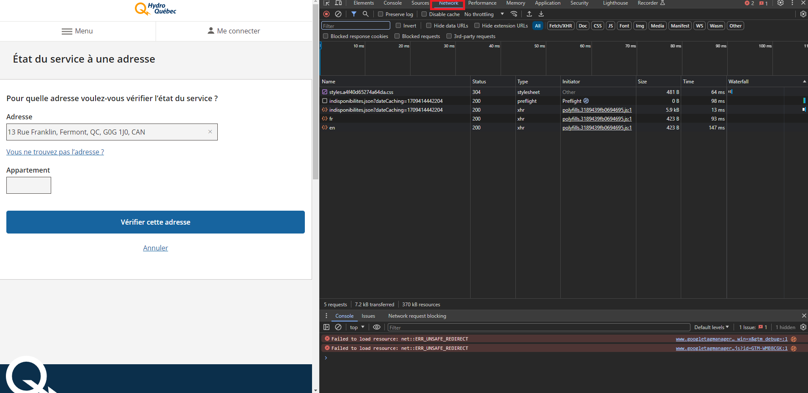
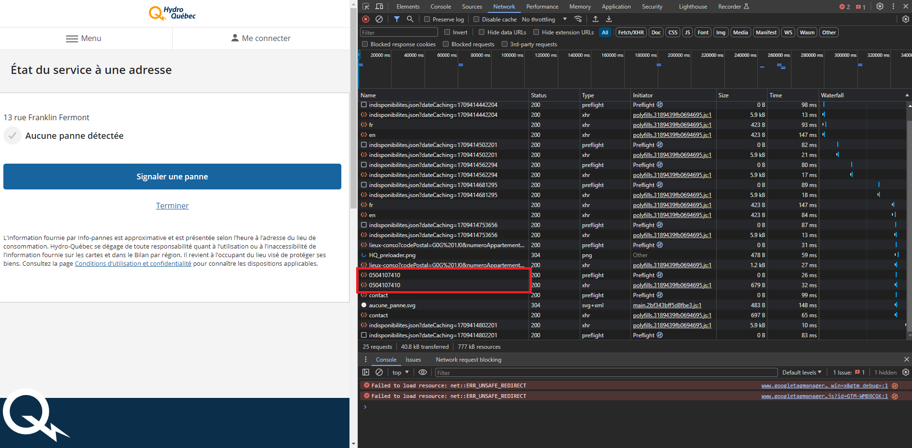

# Configuration Info-panne

## Étape 1

- Ce rendre sur le site de vérification de pannes d'Hydro Québec
[https://infopannes.solutions.hydroquebec.com/statut-adresse/saisir-adresse](https://infopannes.solutions.hydroquebec.com/statut-adresse/saisir-adresse)
- Entrer votre adress, mais **ne cliquer PAS sur "Vérifier cette adresse"**.

## Étape 2

- Ouvrir les dev-tools (F12), puis ce rendre dans la section "Network".

## Étape 3

- Cliquer sur "Vérifier cette adresse"
- Analyser les réponse, puis noter une des deux chaine de nombres

## Étape 4

- Dans le fichier [hydro_quebec_pannes_adresse.yaml](packages/hydro_quebec_pannes_adresse.yaml), remplacer les LOCATION par la chaine de nombres trouvée.