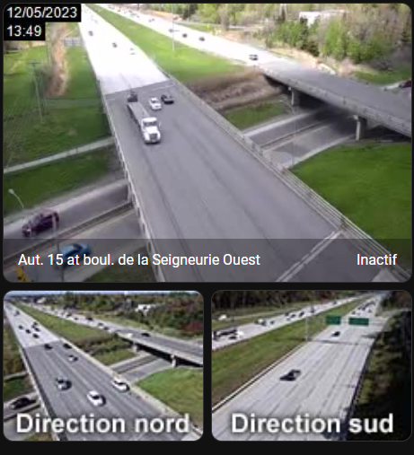

# Ministère des Transports du Québec

## Caméras

Le MTQ publie les images de ses caméras sur les routes du Québec a cette adresse : [https://www.quebec511.info/en/Diffusion/EtatReseau/Cameras.aspx](https://www.quebec511.info/en/Diffusion/EtatReseau/Cameras.aspx)

Il est possible de les ajouter à Home-Assistant.

## TODO

- Ajoutées autres données du MTQ
