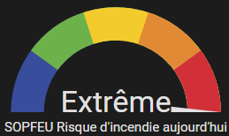
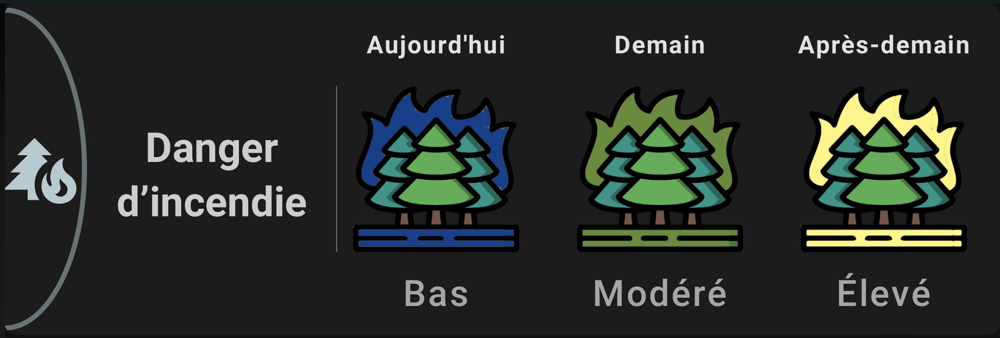
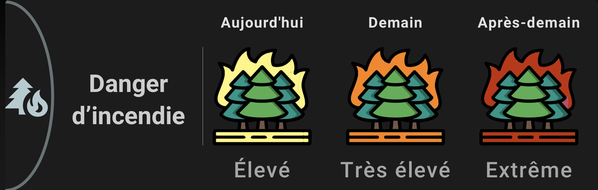
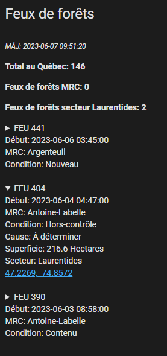

# SOPFEU

La [SOPFEU](https://sopfeu.qc.ca) est un organisme de prévention des incendies qui offre un indice du danger d'incendie ainsi que les recommandations correspondantes à chaque niveau.


## Extractions des données

Les données brutes au format json peuvent être extraites avec les commandes suivantes.
### Feux actifs

```bash
curl -s --request GET "https://cartes.sopfeu.qc.ca/fires?filterChoice=active" | jq
```

### Zones et niveau de risque

```bash
curl -s --request GET https://cartes.sopfeu.qc.ca/risk-zones | jq
```

## Installation

### Capteurs

Les valeurs du fichier [sensors.yaml](sensors.yaml) doivent être ajoutées à votre configuration. Prenez soin d'ajuster les valeurs  afin de refléter la région pour laquelle vous voulez les niveaux d'alertes.

Les exemples utilisent la région 16 (Laurentides) pour les risques, la zone de gestion 151 (Laurentides) et la MRC 78 (Les Laurentides) pour les feux actifs, les autres valeurs possibles découvertes jusqu'à maintenant sont inscrites plus bas.

**SVP, ne réduisez pas inutilement le scan_interval, une vérification aux heures est amplement suffisante et évite de faire des requêtes inutiles aux serveurs de SOPFEU.**

### Interface lovelace

Sous le dossier lovelace vous trouverez deux visualisations à ajouter à votre configuration. Encore une fois les valeurs des secteurs (16) et MRC (78) doivent être remplacées.

#### Jauge



#### Visuel Forêt


[](lovelace/visuel-foret/foret1.jpeg)

[](lovelace/visuel-foret/foret2.jpeg)

#### Carte des feux actifs


## Listes de différentes valeurs et ID

Les valeurs et ID suivants peuvent être utilisés pour filtrer les événements selon les différentes valeurs. Ils ont été extrait durant une période de feu assez active et devrais contenir la majorité des valeurs possible. Il n'est toutefois pas exclu qu'il en manque, si c'est le cas SVP ouvrez un "issue" github pour qu'on puisse les ajouter.

### Valeurs de niveau de risque
|Valeur|Niveau|Description|
|-|-|-|
|1|BAS|Risque d’incendie de faible intensité à propagation limitée, c’est le bon moment pour allumer votre feu de camp.|
|2|MODÉRÉ|Risque d’incendie de surface se propageant de façon modérée et se contrôlant généralement bien, faite uniquement des feux de petite dimension (1m X 1m maximum).|
|3|ÉLEVÉ|Risque d’incendie de surface d’intensité modérée à vigoureuse qui pose des défis de contrôle lors du combat terrestre, n’allumez pas si la vitesse du vent est supérieure à 20 km/h.|
|4|TRÈS ÉLEVÉ|Risque d’incendie de forte intensité avec allumage partiel ou complet des cimes dont les conditions au front sont au-delà de la capacité des équipes terrestres, faites des feux seulement dans des installations munies d’un pare-étincelles réglementaire.|
|5|EXTRÊME|Risque d’incendie de cimes de fortes intensité, qui se propage à grande vitesse et qui peut devenir incontrôlable, évitez de faire des feux.|

Source: [https://sopfeu.qc.ca/comment-calcule-t-on-le-danger-dincendie/](https://sopfeu.qc.ca/comment-calcule-t-on-le-danger-dincendie/)
### Liste des codes d'état


| id | État              |
| -- | ----------------- |
| 0  | Recensé           |
| 2  | Sous-observation  |
| 3  | Hors-contrôle     |
| 4  | Contenu           |
| 5  | Maîtrisé          |
| 6  | Éteint            |

[Référence sur les états](https://sopfeu.qc.ca/comprendre-les-conditions-dun-incendie/)

### Liste des codes d'origine

| id | Origine              |
| -- | ----------------- |
| 1  | Foudre            |
| 2  | Chemin de fer     |
| 3  | Op. forestières   |
| 4  | Op. industrielles |
| 5  | Incendiaires      |
| 6  | Résidants         |
| 7  | Récréation        |
| 8  | Diverses          |
| 9  | À déterminer      |

### Liste de valeur Zone de risques (Région SOPFEU)

| Zone | Emplacement                |
|-------|----------------------------|
| 48    | Baie-des-Chaleurs         |
| 23    | Beauce-Appalaches         |
| 64    | Caniapiscau               |
| 22    | Centre-du-Québec          |
| 29    | Charlevoix                |
| 36    | Chibougamau-Rte du Nord   |
| 53    | Chisasibi                 |
| 38    | Chute-des-Passes          |
| 51    | Eastmain                  |
| 21    | Estrie                    |
| 65    | Fermont-Schefferville     |
| 40    | Forestville-Labrieville    |
| 49    | Gaspé                     |
| 15    | Gatineau                  |
| 60    | Île d'Anticosti            |
| 61    | Îles de la Madeleine       |
| 45    | Kamouraska-RDL-Témisc.    |
| 2     | La Sarre-Amos              |
| 26    | La Tuque                  |
| 37    | Lac Albanel               |
| 32    | Lac-Saint-Jean            |
| 59    | Laforge - 2               |
| 16    | Laurentides               |
| 69    | Le Golfe-du-St-Laurent     |
| 57    | LG-3                       |
| 58    | LG-4                       |
| 8     | Maganasipi-Dumoine         |
| 14    | Manawan                   |
| 43    | Manic 5 - nord SM3        |
| 24    | Maskinongé-Les Chenaux     |
| 1     | Matagami                   |
| 47    | Matane-Chic-Chocs          |
| 6     | Mégiscane-Gouin            |
| 44    | Minganie                  |
| 20    | Montérégie                |
| 63    | Monts-Otish                |
| 35    | Monts-Valin               |
| 54    | Némaska                   |
| 17    | Nord de Montréal          |
| 13    | Outaouais-Labelle          |
| 11    | Parent-Windigo             |
| 12    | Pontiac                   |
| 27    | Portneuf                  |
| 28    | Québec                    |
| 3     | Quévillon-Waswanipi        |
| 56    | Radisson                  |
| 33    | Réserve Ashuapmushuan     |
| 30    | Réserve des Laurentides    |
| 10    | Réserve La Vérendrye       |
| 46    | Rimouski-Matapédia         |
| 68    | Rivière du petit Méticana |
| 34    | Rivière Mistassini         |
| 66    | Rivière Moisie             |
| 67    | Rivière Romaine            |
| 4     | Rouyn-Noranda             |
| 31    | Saguenay                  |
| 55    | Sarcelle                  |
| 42    | Sept-îles                 |
| 25    | St-Maurice-Mastigouche    |
| 7     | Témiscamingue              |
| 62    | Tichégami                 |
| 5     | Val-d'Or-Senneterre        |
| 50    | Waskaganish |
| 52 | Wemindji |

### Liste des codes MRC

| id  | MRC                      |
| --- | ------------------------- |
| 2   | Le Rocher-Percé           |
| 3   | La Côte-de-Gaspé          |
| 4   | La Haute-Gaspésie         |
| 6   | Avignon                   |
| 7   | La Matapédia              |
| 8   | La Matanie                |
| 10  | Rimouski-Neigette         |
| 12  | Rivière-du-Loup           |
| 14  | Kamouraska                |
| 15  | Charlevoix-Est            |
| 18  | Montmagny                 |
| 22  | La Jacques-Cartier        |
| 27  | Robert-Cliche             |
| 28  | Les Etchemins             |
| 29  | Beauce-Sartigan           |
| 30  | Le Granit                 |
| 31  | Les Appalaches            |
| 32  | L'Érable                  |
| 33  | Lotbinière                |
| 34  | Portneuf                  |
| 35  | Mékinac                   |
| 39  | Arthabaska                |
| 40  | Les Sources               |
| 41  | Le Haut-Saint-François    |
| 42  | Le Val-Saint-François     |
| 44  | Coaticook                 |
| 45  | Memphrémagog              |
| 47  | La Haute-Yamaska          |
| 48  | Acton                     |
| 49  | Drummond                  |
| 51  | Maskinongé                |
| 54  | Les Maskoutains           |
| 56  | Le Haut-Richelieu         |
| 61  | Joliette                  |
| 62  | Matawinie                 |
| 63  | Montcalm                  |
| 67  | Roussillon                |
| 70  | Beauharnois-Salaberry     |
| 72  | Deux-Montagnes            |
| 75  | La Rivière-du-Nord        |
| 76  | Argenteuil                |
| 77  | Les Pays-d'en-Haut        |
| 78  | Les Laurentides           |
| 79  | Antoine-Labelle           |
| 80  | Papineau                  |
| 82  | Les Collines-de-l'Outaouais|
| 83  | La Vallée-de-la-Gatineau  |
| 84  | Pontiac                   |
| 85  | Témiscamingue             |
| 86  | Rouyn-Noranda             |
| 87  | Abitibi-Ouest             |
| 88  | Abitibi                   |
| 89  | La Vallée-de-l'Or         |
| 90  | La Tuque                  |
| 91  | Le Domaine-du-Roy         |
| 92  | Maria-Chapdelaine         |
| 93  | Lac-Saint-Jean-Est        |
| 95  | La Haute-Côte-Nord        |
| 96  | Manicouagan               |
| 251 | Lévis                     |
| 371 | Trois-Rivières            |
| 372 | Les Chenaux               |
| 941 | Saguenay                  |
| 942 | Le Fjord-du-Saguenay      |
| 971 | Sept-Rivières             |
| 981 | Minganie                  |
| 991 | Jamésie                   |
| 993 | Nouveau toponyme à venir  |

## Liste des codes des Unitées de Gestion


| id   | Unité                          |
| ---- | ------------------------------ |
|      |                                |
| 11   | Grand-portage                  |
| 12   | Bas-st-laurent                 |
| 23   | Saguenay-sud shipshaw          |
| 24   | Riviere-péribonka              |
| 25   | Roberval saint-félicien         |
| 27   | Mistassini                     |
| 35   | Beauce-appalaches              |
| 41   | Bas-saint-maurice              |
| 42   | Windigo-gouin                  |
| 51   | Estrie                         |
| 52   | Montérégie                     |
| 71   | Coulonge                       |
| 72   | Basse-lièvre                   |
| 73   | Haute-gatineau                 |
| 74   | Cabonga                        |
| 81   | Témiscamingue                   |
| 82   | Rouyn-noranda                  |
| 83   | Val-d'or                        |
| 84   | Megiscane                      |
| 85   | Lac-abitibi                     |
| 86   | Harricana-sud                  |
| 93   | Manicouagan-outardes           |
| 94   | Sept-iles havre-saint-pierre anticosti |
| 97   | Escoumins-forestville           |
| 102  | Chibougamau                     |
| 105  | Mont-plamondon                 |
| 106  | Harricana-nord                 |
| 107  | Quévillon                       |
| 111  | Baie-des-chaleurs               |
| 112  | Gaspésie                        |
| 141  | Lanaudière                      |
| 151  | Laurentides                     |
