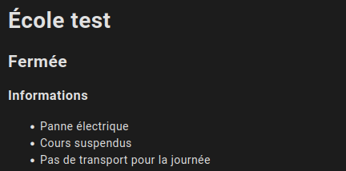
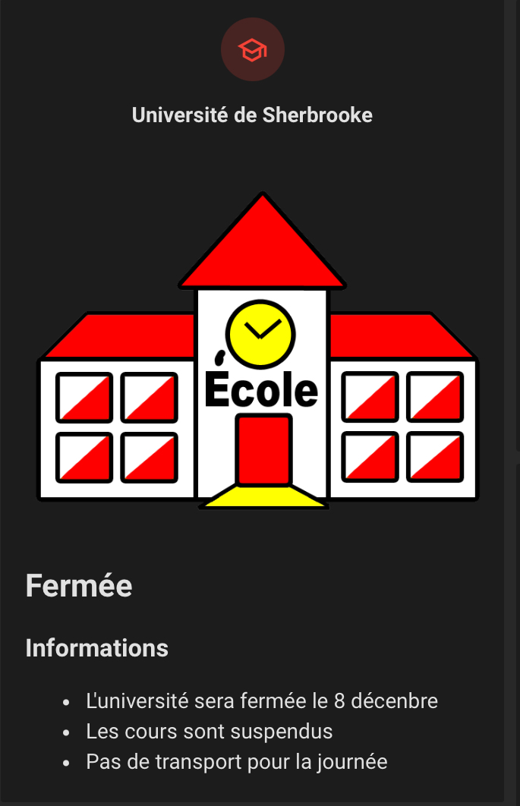
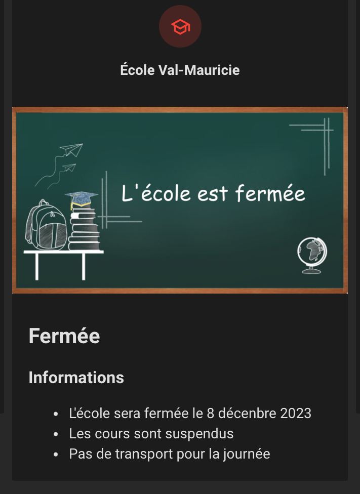

# Écoles fermées

## Extraction des données
TVA fourni une liste des fermeture d'écoles au format json.

- Liste des école et leur id: [https://www.tvanouvelles.ca/api/schools/list](https://www.tvanouvelles.ca/api/schools/list)

- Liste des fermetures: [https://www.tvanouvelles.ca/api/schools/closed](https://www.tvanouvelles.ca/api/schools/closed)

Selon les écoles un message peut être indiqué dans la section de fermeture et/ou dans un tableau.

Un exemple de donnée est disponible dans le dossier [donnees](donnees)

Le fichier des fermetures contient uniquement les écoles qui sont présentement fermées.

## Installation

### Capteurs

Les valeurs du fichier [configuration.yaml](configuration.yaml) doivent être ajoutées à votre configuration. Prenez soin d'ajuster les valeurs afin de refléter l'id de l'école pour laquelle vous voulez les données. Vous pouvez ajouter plus qu'un école an créant d'autre capteurs template

Vous pouvez trouver la liste des id dans le fichier [list.md](list.md). Il ne se mets pas à jour automatiquement donc en cas de doute vérifiez à même le lien dans la section Extraction des données

### Carte Lovelace

Un exemple de carte lovelace est disponible dans le dossier lovelace

### Visulelle Markdown 

### Visulelle École et Tableau

